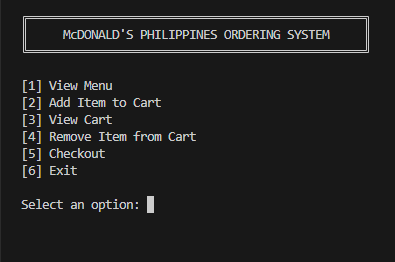
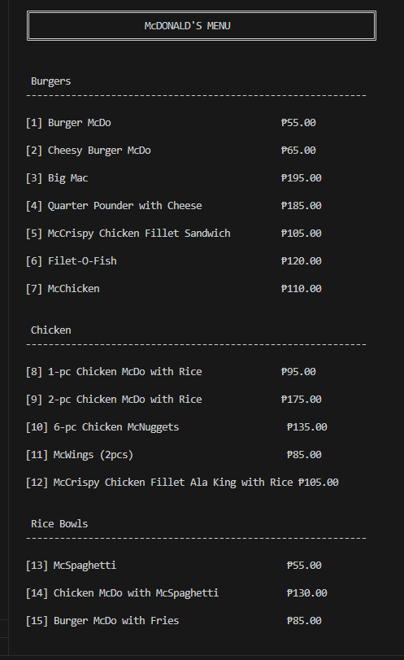
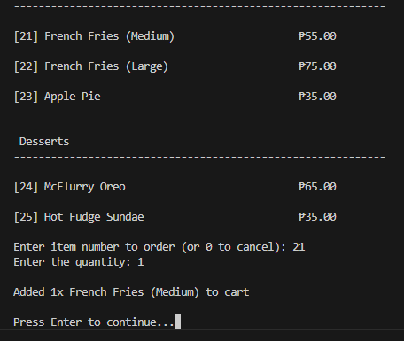
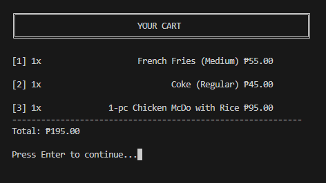
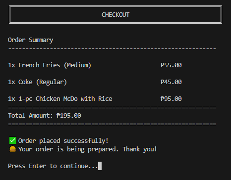

## SIMPLE ORDERING SYSTEM IN GO

### Main Menu


### Ordering Menu


### Adding Item to Cart


### Cart


### Cart


### Checkout


---

<br>
<br>

# Code

### Import necessary packages
- fmt to display text on the screen.
- bufio read user input using scanner.
- os allows user input, since user interactions with the machine process in the os.
- strings to transform text to the desired output.
- strconv converts text to a number.

```go
import (
    "fmt"
    "bufio"
    "os"
    "strings"
    "strconv"
)
```

<br>

### Object Type Declaration

```go
type MenuItem struct {
    ID			int
    Name		string
    Price		float64
    Category	string
}

type OrderItem struct {
    Item		MenuItem
    Quantity	int
}
```

<br>

### Initialization of Global MenuItem Object with Data

```go
var menu = []MenuItem{
    // Burgers
    {1, "Burger McDo", 55.00, "Burgers"},
    {2, "Cheesy Burger McDo", 65.00, "Burgers"},
    {3, "Big Mac", 195.00, "Burgers"},
    {4, "Quarter Pounder with Cheese", 185.00, "Burgers"},
    {5, "McCrispy Chicken Fillet Sandwich", 105.00, "Burgers"},
    {6, "Filet-O-Fish", 120.00, "Burgers"},
    {7, "McChicken", 110.00, "Burgers"},
    ...
}
```

<br>

### New Scanner Object
This scanner object will be used throughout the entire application.

```go
scanner := bufio.NewScanner(os.Stdin)
```

<br>

### Declaration of OrderItem Object, which Represents the Cart for Ordering
As you can see, this is an array of objects, which will hold a list of orders and quantities.

```go
var cart []OrderItem
```

<br>

### Display Header & Action Menu with User Input
It accepts user input using scanner.Scan() and retrieve user input using scanner.Text(). This user-input value will define the desired action by matching it with the case value in the switch statement; each case has its own intended program to be executed with.

```go
for {
    clearScreen()
    fmt.Println("╔════════════════════════════════════════════════╗")
    fmt.Println("║     McDONALD'S PHILIPPINES ORDERING SYSTEM     ║")
    fmt.Println("╚════════════════════════════════════════════════╝")
    fmt.Println("\n[1] View Menu")
    fmt.Println("[2] Add Item to Cart")
    fmt.Println("[3] View Cart")
    fmt.Println("[4] Remove Item from Cart")
    fmt.Println("[5] Checkout")
    fmt.Println("[6] Exit")
    fmt.Print("\nSelect an option: ")

    scanner.Scan()
    choice := scanner.Text()

    switch choice {
    case "1":
        clearScreen()
        displayMenu()
        waitForEnter(scanner)
    case "2":
        clearScreen()
        cart = addItemToCart(scanner, cart)
    case "3":
        viewCart(cart)
        waitForEnter(scanner)
    case "4":
        clearScreen()
        cart = removeFromCart(scanner, cart)
    case "5":
        checkout(cart)
        cart = []OrderItem{}
        waitForEnter(scanner)
    case "6":
        fmt.Println("\nThank you for visiting McDonald's! Goodbye! 👋")
        return
    default:
        fmt.Println("\n❌Invalid input. Please try again")
        waitForEnter(scanner)
    }
}
```

<br>

### Clear Screen

```go
func clearScreen() {
	fmt.Print("\033[H\033[2J")
}
```

<br>

### Break Point
This helps to display things on screen before proceeding to the next iteration. Since it uses for loop that loops over and over again, the scanner holds the screen output until the user presses any key.

```go
func waitForEnter(scanner *bufio.Scanner) {
	fmt.Print("\nPress Enter to continue...")
	scanner.Scan()
}
```

<br>

### Display the List of Items Available to Order
The variable categories is an array of strings that defines which are available.
The fmt.Println(strings.Repeat("-", 60)) will print 60 characters of dashes to create a line.
Variable menu is a global variable, which is an array of objects.
Placeholder helps this to style up and format the string and make it look more appealing, like %-40s, which will add free space at the right(positive number adds space to the left and negative at the right).

```go
func displayMenu() {
	categories := []string{"Burgers", "Chicken", "Rice Bowls", "Drinks", "Sides", "Desserts"}

	fmt.Println("\n╔════════════════════════════════════════════════════════════╗")
	fmt.Println("║                    McDONALD'S MENU                         ║")
	fmt.Println("╚════════════════════════════════════════════════════════════╝")

	for _, cat := range categories {
		fmt.Printf("\n\n %s\n", cat)
		fmt.Println(strings.Repeat("-", 60))

		for _, item := range menu {
			if cat == item.Category {
				fmt.Printf("\n[%d] %-40s ₱%.2f\n", item.ID, item.Name, item.Price)
			}
		}
	}
}
```

<br>

### Adding Item to Cart
The parameters are the scanner and cart object. The first parameter is a pointer reference to the scanner object to save space in memory. The second parameter is a copy of the cart array of objects. This function defines a return value. I will list the process of this function to easily view the entire process under the hood.
- Display the menu.
- Prompts user for input.
- Converts user input, which is a string by default, to an integer.
- Verify the conversion from string to integer execution.
- Creates orderItem object with the type of MenuItem to hold order details.
- Map or search the user order in the menu to retrieve order details.
- Provides a message to the user if the input is undefined or not available in the menu.
- Next is to prompt the user to input the quantity of the order item.
- Get the text input from the scanner using scanner.Text() and transform this string value to an integer.
- Verifies the value's conversion to an integer and ensures valid input, as well as making sure that the value is not less than or equal to zero and not larger than the cart item's number.
- The next thing is to identify whether it exists or not in the cart; if it does, the quantity should be updated by summing up with the new user input. And if it doesn't, then it should be inserted into the cart as a new item.
- The final thing is to display the output message confirming that it was added successfully.

```go
func addItemToCart(scanner *bufio.Scanner, cart []OrderItem) []OrderItem {
	displayMenu()

	fmt.Print("\nEnter item number to order (or 0 to cancel): ")
	scanner.Scan()

	idStr := scanner.Text()
	no, err := strconv.Atoi(idStr)
	
	if err != nil || no <= 0 {
		fmt.Println("\nCancelled!")
		waitForEnter(scanner)
		return cart
	}

	var orderItem *MenuItem
	for _, item := range menu {
		if item.ID == no {
			orderItem = &item
			break
		}
	}

	if orderItem == nil {
		fmt.Println("❌ Unavailable item.")
		waitForEnter(scanner)
		return cart
	}

	// --- quantity

	fmt.Print("Enter the quantity: ")
	scanner.Scan()

	qtyStr := scanner.Text()
	qty, err := strconv.Atoi(qtyStr)

	if err != nil || qty <= 0 {
		fmt.Println("Invalid quantity")
		waitForEnter(scanner)
		return cart
	}

	// --- increase quantity if item is already exists
	// I'm using indexing here to reflect the new value to existing object(cart)
	found := false
	for i := range cart {
		if orderItem.ID == cart[i].Item.ID {
			cart[i].Quantity += qty; // <--
			found = true
			break
		}
	}

	// --- new item
	if !found {
		cart = append(cart, OrderItem{
			Item: *orderItem,
			Quantity: qty,
		})
	}

	fmt.Printf("\nAdded %dx %s to cart\n", qty, orderItem.Name)
	waitForEnter(scanner)
	return cart
}
```

<br>

### View Cart
First, it clears out the screen and then displays the title. This function accepts a cart object or an array of OrderItem object, which holds the details of ordered items in the cart. 
It checks if the cart is empty; if so, then a message pops up, saying the cart is empty, and a return keyword immediately cuts off the process for this function. If the cart is not empty, the process of computing the total for each item proceeds by creating a variable total as a float64 type by inferring a value of 0.0.
A for loop spreads out each item of the cart, which helps to compute the necessary value needed. Sub-total is the price of an item multiplied by the quantity of the order, though in this case, the quantity is an integer and the price is a floating value, so the quantity has to be converted to a floating value to make them compatible and execute the product of these values.
This will display all the order items in the cart, and each subtotal sums up with the variable total. The last thing is to display the total amount of all the items in the cart. 

```go
func viewCart(cart []OrderItem) {
	clearScreen()

	fmt.Println("\n╔════════════════════════════════════════════════════════════╗")
	fmt.Println("║                         YOUR CART                          ║")
	fmt.Println("╚════════════════════════════════════════════════════════════╝")

	if len(cart) == 0 {
		fmt.Println("🛒 Your cart is empty!")
		return
	}

	total := 0.0
	for i, item := range cart {
		subtotal := item.Item.Price * float64(item.Quantity)
		fmt.Printf("\n[%d] %dx %40s ₱%.2f\n",
			i+1, item.Quantity, item.Item.Name, subtotal)
		total += subtotal
	}

	fmt.Println(strings.Repeat("-", 60))
	fmt.Printf("Total: ₱%.2f\n", total)
}
```

<br>

### Remove Item in the Cart
It requires two parameters: the first one is the scanner for user input, and the cart object to access and modify the values it has. Also, this function returns the updated list of cart items with the type of OrderItem. 
This function first displays the cart's items, and checks if it doesn't have items inside; if so, the return keyword will immediately end the process for this function.
Let's assume the user has lots of orders in this cart and wants to remove a specific one. 
Function prompts the user to enter the number of an item that needs to be removed.
User input value will be pulled over and should be converted to an integer as it is a string, and verify the conversion execution if everything is fine.
Followed by another check to ensure that the input is not out of bounds with the available items in the cart.
The next thing is to slice the list up to get the items on the left and right side of the list of the selected item, and merge both sides together without the selected item off course, since it needs to be removed in this case.
It ends with the message that the action is completed successfully.

```go
func removeFromCart(scanner *bufio.Scanner, cart []OrderItem) []OrderItem {
	viewCart(cart)

	if len(cart) == 0 {
		waitForEnter(scanner)
		return cart
	}

	fmt.Print("Enter item number to remove (or 0 to cancel): ")
	scanner.Scan()

	noStr := scanner.Text()
	no, err := strconv.Atoi(noStr)

	if err != nil || no == 0 {
		fmt.Println("❌ Cancelled!")
		waitForEnter(scanner)
		return cart
	}

	if no < 1 || no > len(cart) {
		fmt.Println("Invalid item number")
		return cart
	}

	removedItem := cart[no-1].Item.Name
	cart = append(cart[:no-1], cart[no-1+1:]...)

	fmt.Printf("\n✅ Removed %s from cart!\n", removedItem)
	waitForEnter(scanner)
	return cart
}
```

<br>

### Checkout
This function only computes the total amount of the items in the cart. It is similar to viewing the cart, and the process is actually identical.

```go
func checkout(cart []OrderItem) {
	clearScreen()

	fmt.Println("╔════════════════════════════════════════════════════════════╗")
	fmt.Println("║                          CHECKOUT                          ║")
	fmt.Println("╚════════════════════════════════════════════════════════════╝\n")

	if len(cart) == 0 {
		fmt.Println("🛒 Your cart is empty!")
		return
	}

	fmt.Println("Order Summary")
	fmt.Println(strings.Repeat("-", 60))

	total := 0.0
	for _, item := range cart {
		subtotal := item.Item.Price * float64(item.Quantity)
		fmt.Printf("\n%dx %-40s ₱%.2f\n", item.Quantity, item.Item.Name, subtotal)
		total += subtotal
	}

	fmt.Println(strings.Repeat("=", 60))
	fmt.Printf("Total Amount: ₱%.2f\n", total)
	fmt.Println(strings.Repeat("=", 60))

	fmt.Println("\n✅ Order placed successfully!")
	fmt.Println("🍔 Your order is being prepared. Thank you!")
}
```